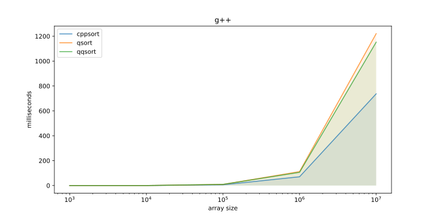
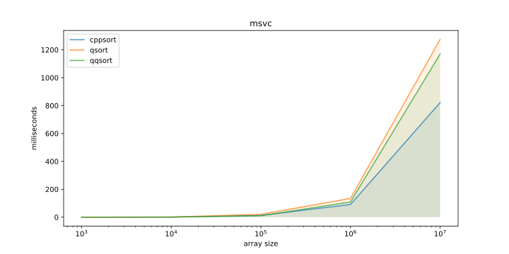
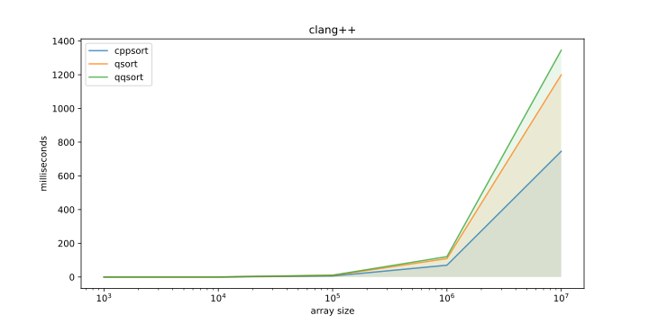

<p align="center">
    
</p>

<p align="center">
    
    
</p>

The `qqsort` macro is a reimplementation of [qsort](https://codebrowser.dev/glibc/glibc/stdlib/qsort.c.html) function from glibc with more ability to inline comparison function.

# Usage

```c
#include <stdio.h>
#include "qqsort.h"

int main(void) {
    int array[] = {4, 3, 2, 1, 0, 5, 6, 7, 8, 9};
    int size = sizeof(array) / sizeof(array[0]);

    qqsort(array,
           size,
           sizeof(int),
           qqsortcmp(int *a, int *b) {
                qqsortret(*a - *b);
           });

    for (int idx = 0; idx < size; idx++) {
        printf("%d ", array[idx]);
    }

    return 0;
}
```

# Benchmark

> ❗This project is just an experiment to study the influence of inlining on code performance.

For the benchmark, a simple C++ [program](./benchmark/main.cpp) was implemented to sort an array of structures in three ways:

* Sorting using `stl`
* Sorting using the `qsort` function of the library
* Sorting with the `qqsort` macro

Three compilers were used to build the benchmark:

* `g++`
* `clang++`
* `msvc`

The following compilation flags were used:

```python
COMPILE_ARGS = [ "-flto", "-O2", ... ]
```

The `qqsort` macro showed positive results in performance only when using the `g++` and `msvc` compilers. When using `clang++`, the `qqsort` macro performs worse than the `qsort` function.





